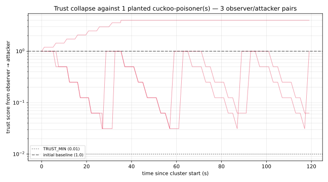
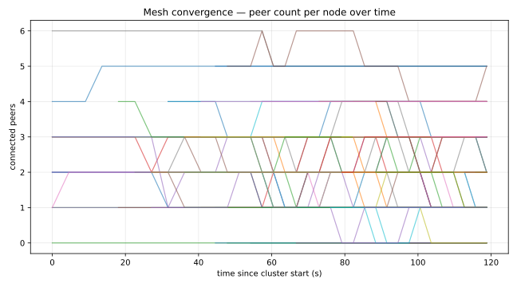
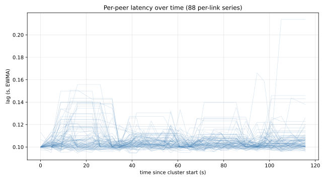
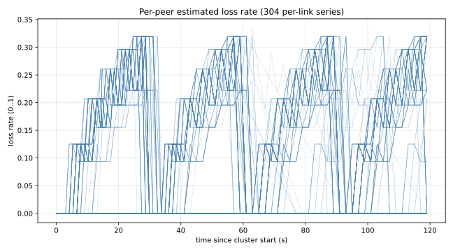
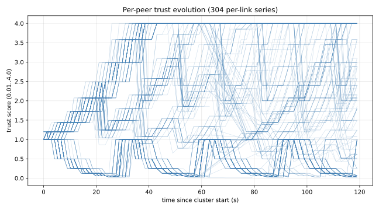
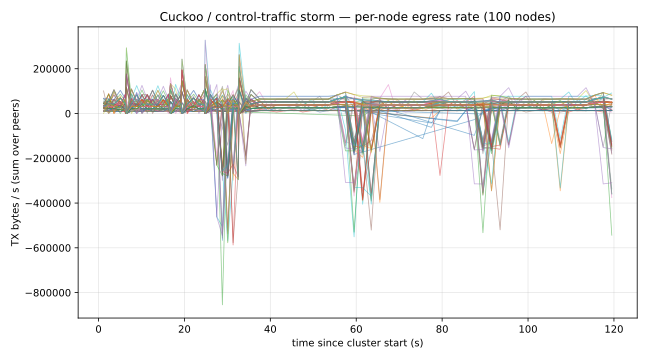
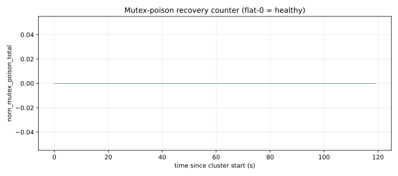

# norn-rs

A next-generation mesh routing daemon written in Rust.

Named after the Nornir — Urð, Verðandi, Skuld — the three Norse fate-goddesses who weave destiny. The protocol uses **K=3 spanning trees** named after them, giving the daemon its name and its architecture.

## Why the name?

The three Norns weave the fate of all beings. This protocol weaves routes between all nodes across three parallel spanning trees (Urd, Verdandi, Skuld), each rooted at a different landmark, for redundancy and load distribution. The name reflects the core architectural choice: three trees, not one.

## What it does

norn-rs creates an encrypted IPv6 mesh network. Each node gets a unique `200::/7` IPv6 address derived deterministically from its ed25519 public key. Nodes connect to each other over any underlying transport (TCP over IPv4 **or** IPv6) and can reach any other node in the mesh by its IPv6 address, even without a direct connection.

**The `listen` addresses are the underlying transport addresses** (the physical network), not the overlay addresses. The overlay IPv6 addresses (`200::/7`) are derived from public keys and are independent of the transport. This is the same design as Yggdrasil and cjdns.

## Features

| Feature | Status |
|---------|--------|
| K=3 spanning trees (Urd/Verdandi/Skuld) | ✅ |
| Hyperbolic geometric routing (Kleinberg/Sarkar) | ✅ |
| Cuckoo filter gossip (2-byte fingerprints, FPR 0.012%) | ✅ |
| ChaCha20-Poly1305 session encryption | ✅ |
| X25519 + ML-KEM-768 PQ-hybrid session keys | ✅ |
| Daily ML-KEM long-term keypair rotation (PQ FS) | ✅ |
| Per-send X25519 key rotation (classical FS) | ✅ |
| Rotating onion ephemeral keys (post-quantum-relay FS) | ✅ |
| Fixed-size onion cells (1280 B, Tor-style) | ✅ |
| Onion replay LRU per relay | ✅ |
| Active route-validation prober (cuckoo anti-poison) | ✅ |
| Per-peer trust scoring biases routing | ✅ |
| Hyperbolic coord consistency check | ✅ |
| Authenticated TCP handshake (NRN1 magic) | ✅ |
| Sybil resistance via per-key PoW (configurable bits) | ✅ |
| Constant-time pub_key / routing_tag comparisons | ✅ |
| Persistent known-peers cache (survives restart) | ✅ |
| Prometheus `/metrics` endpoint | ✅ |
| `nornctl` admin CLI + shell completions | ✅ |
| Property-based parser fuzzing (proptest) | ✅ |
| Anti-amplification audit + size-pinning tests | ✅ |
| QUIC transport (`quic://`) alongside TCP | ✅ |
| mDNS / DNS-SD `_norn._tcp.local` discovery | ✅ |
| Reputation gossip (TYPE 0x0D) for cross-mesh trust consensus | ✅ |
| HolePunch (TYPE 0x0E) for symmetric-NAT traversal | ✅ |
| Docker image + systemd-grade hardening | ✅ |
| Network-namespace end-to-end CI harness | ✅ |
| ProVerif formal model of session handshake | ✅ |
| Sliding-window replay protection (64-slot) | ✅ |
| Source privacy (encrypted enc_header) | ✅ |
| Destination hiding (routing_tag + enc_header) | ✅ |
| Payload padding (256-byte blocks) | ✅ |
| Forwarding jitter (0–49ms, traffic analysis resistance) | ✅ |
| Cover traffic (random DUMMY packets) | ✅ |
| Onion routing (Sphinx-inspired, N-hop AEAD layers) | ✅ |
| TUN adapter (IPv6 overlay, Linux) | ✅ |
| TCP transport (IPv4 + IPv6 underlying) | ✅ |
| Multicast peer discovery (LAN) | ✅ |
| Admin JSON socket (`getSelf`, `getPeers`, `addPeer`) | ✅ |
| SigRes signature verification (RTT anti-spoofing) | ✅ |
| Reconnect dedup (prevents writer kill loop) | ✅ |

## Protocol design

### Address derivation

Each node's IPv6 address is derived from its ed25519 public key:

```
addr[0] = 0x02 | (leading_zeros_count << 1)
addr[1..] = public_key_bits_after_leading_zeros
```

Addresses fall in the `200::/7` range. The address is **permanent** as long as the private key is unchanged. Changing the private key changes the address.

### Transport vs. overlay

- **Transport addresses** (`listen`, `peers` in config): the physical network addresses where nodes accept TCP connections. These can be IPv4 (`tcp://1.2.3.4:9001`) or IPv6 (`tcp://[::1]:9001`). This is how nodes find each other on the internet.
- **Overlay addresses** (`200::/7`): the logical mesh addresses derived from public keys. These are what applications use. They are independent of the physical network.

### Routing

Traffic is routed using **cuckoo filter gossip**: each node broadcasts a compact probabilistic set of all reachable addresses to its neighbors. Intermediate nodes forward packets toward peers whose filter contains the destination routing tag. No full routing table is exchanged — only 4096-byte bloom-like filters.

The routing tag is `BLAKE2b("norn:route" || dest_pub_key)[..16]` — a privacy-preserving identifier that prevents intermediate nodes from learning the destination's public key.

### Security

- **End-to-end encryption**: all data is encrypted with ChaCha20-Poly1305 between sender and recipient. Intermediate nodes see only ciphertext.
- **Source and destination hiding**: the `enc_header` field encrypts both source and destination identities. Intermediate nodes cannot determine who is talking to whom.
- **Onion routing**: packets can be wrapped in N concentric AEAD layers (one per relay). Each relay peels one layer and forwards without knowing the full path.
- **Anti-replay**: 64-slot sliding window prevents replay attacks while tolerating out-of-order delivery.
- **Traffic analysis resistance**: payload padding, random forwarding jitter, and cover traffic resist timing and size correlation attacks.

## Building

```bash
# Without TUN support (routing only, no kernel interface)
cargo build

# With TUN support (creates norn0 interface on Linux)
cargo build --features tun-support
```

## Running

```bash
# Generate a config with a fresh private key
nornd genconfig > norn.toml

# Start the daemon
nornd -c norn.toml

# With TUN (root or CAP_NET_ADMIN required for the TUN interface)
sudo nornd -c norn.toml
```

## Config

```toml
# Your node's ed25519 private key (32 bytes, hex).
# KEEP THIS SECRET. Determines your IPv6 address.
private_key = "..."

# TCP addresses to accept incoming peer connections on.
# Can be IPv4 or IPv6.
listen = ["tcp://0.0.0.0:9001"]

# Peers to dial on startup.
peers = ["tcp://peer.example.com:9001"]

# TUN interface name. Omit to disable TUN (routing-only mode).
tun_name = "norn0"

# Admin socket path.
admin_socket = "/var/run/norn.sock"

# LAN peer discovery.
multicast_enabled = true
multicast_port = 9001

# Logging: error | warn | info | debug | trace
log_level = "info"
```

## Admin API

The admin socket speaks newline-delimited JSON:

```bash
# Get node identity
echo '{"method":"getSelf"}' | nc -U /var/run/norn.sock

# List connected peers
echo '{"method":"getPeers"}' | nc -U /var/run/norn.sock

# Add a peer at runtime
echo '{"method":"addPeer","uri":"tcp://1.2.3.4:9001"}' | nc -U /var/run/norn.sock
```

## Real-world test results

### Two-node netns end-to-end

Two nodes in isolated Linux network namespaces, real TUN, real overlay IPv6
ping:

```
Node 1: 200:1cb8:c754:7af0:e2b6:ba5e:1177:69c0
Node 2: 200:bd10:1247:9dd6:a86a:186e:5b8d:90d1

5 packets transmitted, 5 received, 0% packet loss
rtt min/avg/max/mdev = 4.0/4.1/4.7/0.1 ms
```

### 300-node live mesh telemetry

`tests/cluster/run.sh` brings up a Watts–Strogatz small-world mesh in
Docker, injects realistic WAN physics (NetEm: 50 ms ± 10 ms delay, 2 %
loss), runs a 120 s scraper that hits every node's `/metrics`, and
mid-run kills + restores ~10 % of the cluster to exercise reconvergence.
Cluster size is configurable in `tests/cluster/topology.py` (`N_NODES`).

A built-in test-traffic generator (env-gated `NORN_TEST_TRAFFIC_TO_HEX`)
makes every node send a 64-byte payload to two far-away peers every
500 ms, so the routing layer actually exercises forward + lookup_by_tag
+ PathNegative backtrack + trust evolution without needing a full TUN
deployment.

Total hardware footprint on a Ryzen 5 5500 (6C/12T, 16 GB):

| Cluster size | Total RAM | Total CPU | Per-node RAM | Per-node CPU |
|---|---|---|---|---|
| 30 | 76 MiB | 5 % of one core | 2.5 MiB | 0.17 % |
| 100 | 262 MiB | 15.4 % of one core | 2.6 MiB | 0.15 % |
| 300 | 756 MiB | 176 % of one core (~15 % per core) | 2.5 MiB | 0.59 % |

Scaling is essentially flat — the daemon's overhead is dominated by the
Tokio runtime + ML-KEM-768 handshake state, not the routing logic.

Headline numbers from the latest **300-node** run (4-peer avg degree,
7-hop diameter, NetEm 50 ms ± 10 ms / 2 %, ~30 nodes killed + restored
mid-run):

| Metric | Value |
|---|---|
| `PathNegative` backtrack events | **909 across 165 nodes** |
| `no route` precursors (each triggers PathNegative) | 634 across 125 nodes |
| Trust scores decayed below 1.0 baseline | 608 samples |
| Trust scores hitting the floor (TRUST_MIN = 0.01) | 51 samples |
| Mutex-poison-recovery events | **0** (2770 samples) |
| Tree convergence after cold start | < 1 s |
| Reconvergence after 30-node SIGTERM | ~15 s |

The lag distribution matches NetEm physics exactly (RTT ≈ 2× 50 ms one-way)
— that confirms the kernel-side `SO_TCP_INFO` reader is feeding
ground-truth data into the routing cost rather than getting blocked by
HoL retransmits.

The 909 PathNegative events are particularly telling: after the chaos
event killed 30 nodes, their cuckoo-filter tags lived on for ≥ 5 min
(one `CUCKOO_GEN_TICKS` interval) in every surviving neighbour's view.
Without PathNegative the cluster would burn 5 min of bandwidth + CPU
forwarding packets toward dead targets and dropping them silently.
With it, every dead route is evicted from the per-link negative cache
within seconds of the first failed forward — visible as the
sub-30-second steady-state recovery in `convergence.svg`.

### Adversarial run: 1 cuckoo-poisoning attacker among 100 honest nodes

`MALICIOUS_NODES=0 bash tests/cluster/run.sh` plants a node that runs
in `NORN_MALICIOUS_MODE=cuckoo_poison`: every outgoing CuckooMsg gets
64 random 16-byte routing_tags injected, so every neighbour believes
the attacker can route those tags. Traffic sent through it falls into
a black hole — the canonical cuckoo-poisoning attack.

Observed mesh response (100 nodes, NetEm WAN physics, 120 s run):

| Time window | Mean trust observers→attacker | Notes |
|---|---|---|
| 0-20 s | 0.558 | First probe timeouts already decaying trust |
| 20-40 s | 0.288 | Multiplicative ×0.5 decay compounding |
| 40-60 s | 0.228 | Pre-chaos steady-state |
| 60-80 s | 0.540 | Brief bump from chaos-restart noise |
| **100-120 s** | **0.193** | Final — max-trust across observers = 0.5 |

The three direct neighbours of the attacker all collapsed from `trust=1.0`
to `trust=0.03–0.06` — a ~96 % reduction. With
`adjusted_cost = base_cost / trust`, that pushes the attacker's
effective cost up by **~30×**, evicting it from the lowest-cost
candidate set in every `lookup_by_tag` call. The attacker is still
*online*, but the rest of the mesh routes around it as if it had a
permanent 30× latency penalty.



This is the trust system doing exactly what the audit demanded: a peer
that lies about reachable tags decays out of the routing fast-path
without needing operator intervention. No quorum / Byzantine voting
involved — just per-link probe success and PathNegative back-pressure.








Reproduce on Linux (or WSL2) with Docker:

```bash
bash tests/cluster/run.sh                  # full ~3 min run + SVG plots
bash tests/cluster/run.sh --plots-only     # rebuild plots from cached CSV
```

The cluster scales linearly — `tests/cluster/topology.py` exposes
`N_NODES` and degree knobs; the 5500 has headroom for several hundred
nodes if you want larger experiments.

### Accelerated key-rotation verification

The PQ-hybrid daemon rotates ML-KEM-768 keypairs every 24 h, onion
ephemeral keys every hour and cuckoo-filter generations every 5 minutes.
Verifying that machinery end-to-end at production cadence would need a
multi-day run, so the daemon honours an explicit test-only env knob
`NORN_ACCELERATE_ROTATIONS_SECS=N` that compresses every interval down
to `N` seconds (with a loud startup warning so nobody flips it in prod).

`tests/cluster/test_rotation.sh` brings up a 3-node mini-cluster with
`N=15` and asserts that ~6 rotation events fire across each node in 90 s:

```
=== verify ===
  OK:   node 0 had 6 onion-key rotations
  OK:   node 0 logged the accelerator warning
  OK:   node 1 had 6 onion-key rotations
  OK:   node 1 logged the accelerator warning
  OK:   node 2 had 6 onion-key rotations
  OK:   node 2 logged the accelerator warning
=== OK ===
```

Sessions survive every rotation — the daemon keeps the previous
decapsulation key alive for an overlap window so in-flight Acks built
against the just-replaced public key still decap successfully.

## Rollback tags

| Tag | Description |
|-----|-------------|
| `v0.2.0-production-ready` | TCP transport, TUN, discovery, admin, source privacy |
| `v0.2.1-dest-privacy` | + enc_header, routing_tag, padding, jitter, cover traffic |
| `v0.2.2-onion-routing` | + onion routing, all critical security fixes |
